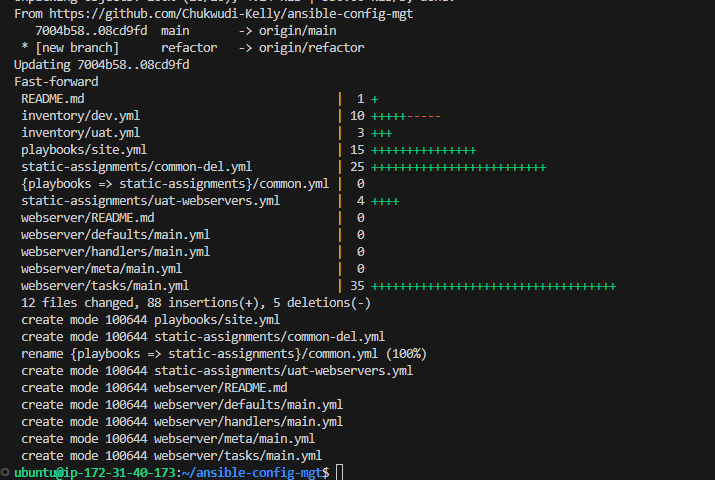
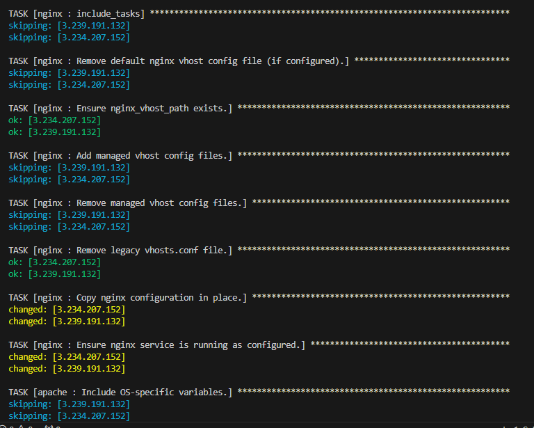

# Ansible-Dynamic-Assignments-and-Community-Roles

This project is a continuation of project 12. I will be introducing Dynamic assignment here. Project 11 and 12 focused on how to perform configuration using playbooks and the import module (Static assignment).
In Ansible, dynamic assignment and static assignment refer to how variables or configurations are set and used within playbooks. Understanding the difference helps in structuring playbooks for flexibility and reuse.
Recap on Static assignment,
Static assignment refers to defining variables with fixed values ahead of time in playbooks, inventory files, or role variables. These variables are set once and do not change during the execution of the playbook unless manually modified.Thus, all statements are pre-processed at the time playbooks are parsed
Major features of static assignment includes -
Variables are defined with hardcoded values.
Values remain the same throughout the playbook execution.
Simple to use and predictable

Dynamic assignment in Ansible refers to assigning variables or configurations during playbook execution. This can be based on conditions, facts gathered from the system, or dynamically created values. Thus, after the statements are parsed, any changes to the statements encountered during execution will be used. Major features of Dynamic assignment includes -
Values can change based on conditions, system facts, or runtime data.
Flexible and allows you to handle different scenarios dynamically.
Requires more complexity, such as using set_fact, register, or conditionals.
in a nutshell, 

import = Static

include = Dynamic

## How To Implement Ansible Dynamic Assignments (Include) and Community Roles

To enable parallel development, experimentation, and maintain the stability of the main project or codebase,as always, create and switch into a new branch, dynamic-assignments.

Create a new folder, name it dynamic-assignments. 


Then inside this folder, create a new file and name it env-vars.yml. We will instruct site.yml to include this playbook later. For now, let us keep building up the structure.

Your GitHub shall have following structure by now.

Note: Depending on what method you used in the previous project you may have or not have roles folder in your GitHub repository – if you used ansible-galaxy, then roles directory was only created on your Jenkins-Ansible server locally. It is recommended to have all the codes managed and tracked in GitHub, so you might want to recreate this structure manually in this case – it is up to you.

```
  ├── dynamic-assignments
│   └── env-vars.yml
├── inventory
│   └── dev.yml
    └── stage.yml
    └── uat.yml
    └── prod.yml
└── playbooks
    └── site.yml
└── roles (optional folder)
    └──...(optional subfolders & files)
└── static-assignments
    └── common.yml
```


Update the env-vars.yml file with the following codebase:

```
---
- name: collate variables from env specific file, if it exists
  hosts: all
  tasks:
    - name: looping through list of available files
      include_vars: "{{ item }}"
      with_first_found:
        - files:
            - dev.yml
            - stage.yml
            - prod.yml
            - uat.yml
          paths:
            - "{{ playbook_dir }}/../env-vars"
      tags:
        - always

```


There are 3 things to notice in the codebase above:

1. include_vars syntax instead of include was used, this is because Ansible developers decided to separate different features of the module. From Ansible version 2.8, the include module is deprecated and variants of include_* must be used. These are:
include_role, include_tasks, include_vars. In the same version, variants of import were also introduces, such as: import_role, import_tasks

2. Special variables { playbook_dir } and { inventory_file }. { playbook_dir } was used as it will help Ansible to determine the location of the running playbook, and from there navigate to other path on the filesystem. { inventory_file } on the other hand will dynamically resolve to the name of the inventory file being used, then append .yml so that it picks up the required file within the env-vars folder.

3. variables are being included using a loop. with_first_found implies that, looping through the list of files, the first one found is used. This is good so that default values can always be set in case an environment specific env file does not exist.

Since I will be using the same Ansible to configure multiple environments, and each of these environments will have certain unique attributes, such as servername, ip-address etc., I will need a way to set values to variables per specific environment.

For this reason, it will be wise to create a folder to keep each environment’s variables file. Therefore, create a new folder env-vars, then for each environment, create new YAML files which will be used to set variables.

The layout should have this structure.

```
├── dynamic-assignments
│   └── env-vars.yml
├── env-vars
    └── dev.yml
    └── stage.yml
    └── uat.yml
    └── prod.yml
├── inventory
    └── dev.yml
    └── stage.yml
    └── uat.yml
    └── prod.yml
├── playbooks
    └── site.yml
└── static-assignments
    └── common.yml
    └── webservers.yml  
```

Update site.yml with dynamic assignments-
Update the site.yml playbook configuration file to import files from the dynamic-assignments directory.

```
---
- hosts: all
  become: true
  name: Import Dynamic Variables
- import_playbook: ../dynamic-assignments/env-vars.yml
```


Add untracked files and commit changes.


Go to Github, make a compare and pull reuest


Now, in ansible-config-mgt directory on your local machine, switch to main branch and create a pull request




ssh into Jenkins-Ansible server
```
eval `ssh-agent -s`

ssh-add <server private-key>

ssh-add -l

ssh ubuntu@<public_ipv4_address_of_jenkins_server
```

Check if git is installed on the Jenkins-Ansible server


Run the following commands to initialize a repository, pull files from your ansible-config-mgt repository on GitHub, add a new remote repository reference, create and switch to the roles-feature branch.

```
git init

git pull https://github.com/<your-name>/ansible-config-mgt.git
git remote add origin https://github.com/<your-name>/ansible-config-mgt.git
git branch roles-feature
git switch roles-feature
```

#### Community Roles

Now it is time to create a role for MySQL database – it should install the MySQL package, create a database and configure users

Using Ansible Galaxy, Download Community Roles for Apache, Nginx and MySQL into the roles directory
Go into the roles directory.

```
cd roles
```

Create a MySQL role with Ansible Galaxy using the following command:
```
ansible-galaxy install -p . geerlingguy.mysql
```


Create an Nginx role with Ansible Galaxy using the following command:

```
ansible-galaxy install -p . geerlingguy.nginx
```


Create an Apache role with Ansible Galaxy using the following command:
```
ansible-galaxy install -p . geerlingguy.apache
```


Rename the downloaded role directories.

```
mv geerlingguy.apache/ apache && mv geerlingguy.nginx/ nginx && mv geerlingguy.mysql/ mysql && ll
```


The role directoryshould look like


Merge changes from the roles-feature into the main branch

```
git add roles/apache/ roles/mysql/ roles/nginx/
git commit -m "Commit new role files into GitHub"
git push --set-upstream origin roles-feature
```
Configure their main.yml file in their Defaults Folder

```
cd roles && cd mysql && cd default && vi main.yml
```


Set the roles_path in Ansible in ansible.cfg


Tasks Using ansible.builtin (Explicit Namespace)
When you use ansible.builtin, you're explicitly referencing the module that comes from Ansible's core modules (those built into Ansible itself). This was introduced to prevent conflicts between modules that have the same name but come from different collections.

Tasks Without ansible.builtin (Implicit Namespace)
When you omit the ansible.builtin (ansible.builtin.) namespace, Ansible assumes you're referring to modules in its core collection, but it is implicit. In older versions of Ansible, this was the default behavior. Starting with Ansible 2.10 and later, Ansible uses collections, and not specifying a namespace can sometimes cause ambiguity if multiple collections have similarly named modules.
check in to and edit ansible.builtin.
roles/mysql/tasks/main.yml
roles/mysql/tasks/configure.yml
roles/mysql/tasks/variable.yml
roles/mysql/tasks/secure_installation.yml


#### LOAD BALANCER ROLES

since we can't engage Nginx and Apache same time, one has to choose which Load Balancer to use, Nginx or Apache, so we need to have two roles respectively:

Nginx
Apache

we have to add a condition to enable either one – this is where you can make use of variables

Create a loadbalancer.yml file in the static-assignments directory, update the site.yml and dev.yml file in the playbook and env-vars directories respectively


Paste the following codebase to reference your roles and conditions for running your roles in the loadbalancer.yml file:

```
- hosts: lb
  become: true
  roles:
    - { role: roles/nginx, when: enable_nginx_lb and load_balancer_is_required }
    - { role: roles/apache, when: enable_apache_lb and load_balancer_is_required }

```

Update the site.yml file to import the loadbalacer.yml file.

```
- name: Loadbalancer assignment
  hosts: lb
- import_playbook: ../static-assignments/loadbalancers.yml
  when: load_balancdr_is_required
  ```

  

Declare variables in the dev.yml file in the env-vars directory to meet the conditions set to execute a role at a time.

```
enable_nginx_lb: true
enable_apache_lb: false
load_balancer_is_required: true
```


Go to the ansible-config-mgt directory on the Jenkisn-Ansible server.

in the inventory.devl file, close other sservers except the server to be configured, loadbalancer.


```
cd /home/ubuntu/ansible-config-mgt/
```
Run the Ansible Playbook.
```
ansible-playbook -i inventory/dev playbooks/site.yml
```





To disable Nginx on the lb host, run the Ansible Adhoc command 
```
ansible lb -i inventory/dev -m command -a "systemctl disable nginx" -b
```
To stop Nginx on the lb host, run the Ansible Adhoc Command to 

````
ansible lb -i inventory/dev -m command -a "systemctl stop nginx" -b
````

```
enable_nginx_lb: false
enable_apache_lb: true
load_balancer_is_required: true
```

Run the playbook again


Change the variables enabling Apache, Nginx and MySQL in the dev.yml file in the env-vars directory to meet the conditions for executing the MySQL role.

```
enable_nginx_lb: false
enable_apache_lb: false
enable_apache_lb: true
load_balancer_is_required: true
```


Update the loadbancer.yml file in the static-assignments directory to include the MySQL role and change the host to db


Run the playbook


